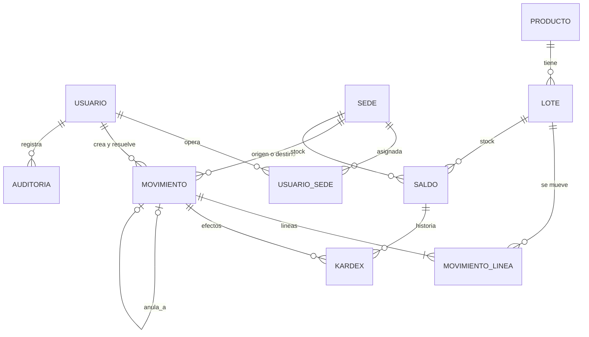

# Sistema de Inventario por Sedes — Especificación v0.3

**Proyecto:** Analítica – RP Dental
**Fecha:** 2026-10-01
**Estado:** Borrador para validación (reemplaza a v0.2)

## Cambios frente a v0.2

| # | Tema | v0.2 | v0.3 |
|---|------|------|------|
| 1 | Roles | Admin, Jefe de bodega, Auxiliar, Consulta | **SUPERADMIN, ADMIN, BASE** |
| 2 | Cómo entra mercancía | Tipo INGRESO (compra, devolución, carga inicial, ajuste) | **Solo entra por traslado.** No se registran compras. La mercancía nueva sale de una *sede origen sin saldo* (Bodega ERP) |
| 3 | R8 | Producto y lote deben existir en el ERP | **Se elimina.** Lo físico es lo real: se registra lo que se envía físicamente, esté o no en el ERP |
| 4 | Ajuste de conteo | Un ingreso o salida más | **Tipo AJUSTE propio.** Solo corrige diferencias de conteo y no toca el saldo hasta que un admin lo aprueba |
| 5 | Estados de traslado | ENVIADO → ACEPTADO / RECHAZADO + filtro "en tránsito" | **NO_CONFIRMADO → RECIBIDO / RECHAZADO.** No existe "en tránsito" |
| 6 | Recepción parcial | El destino digitaba lo recibido; la diferencia volvía al origen | **No existe.** Se recibe todo o se rechaza todo; si no cuadra, se rechaza y el origen crea otro |
| 7 | ERP (antes 4.5) | Fuente obligatoria de productos y lotes | **Solo catálogo de sugerencias** (nombres, referencias, lotes) para digitar más rápido |
| 8 | Tecnología | Python/FastAPI + React o HTMX | **Node + Express + Prisma** (backend) y **React + Vite** (frontend), SQL Server |
| 9 | Kardex | Se calculaba desde los movimientos | **Tabla `kardex` propia** (ver 6.9): un traslado afecta al origen y al destino en momentos distintos |

---

## 1. Qué es

Una aplicación web sencilla para reemplazar el kardex en Excel y aislar el **inventario aprobado** (lo que se verificó físicamente) del **inventario contaminado** del ERP. Tiene:

1. Usuarios con uno de tres roles y sus sedes asignadas.
2. Sedes, incluida una sede origen sin saldo (Bodega ERP) por donde entra la mercancía nueva.
3. Movimientos en una sola tabla: traslados, salidas, ajustes y anulaciones.
4. Inventario por sede (sede × producto × lote), que nunca puede quedar negativo.
5. Kardex: cada cambio de saldo con su documento y el saldo que quedó.
6. Auditoría de cambios: quién, cuándo, qué había y qué quedó.

Del ERP (`SAPROD`, `SALOTE`) solo se toman nombres, referencias y lotes como **sugerencias** al digitar. Si algo no está en el ERP, se registra igual: manda lo físico.

## 2. Reglas de inventario

| Código | Regla |
|--------|-------|
| R1 | Ningún saldo puede quedar negativo. |
| R2 | No se puede sacar de una sede más unidades de las que tiene de ese lote. |
| R3 | No se puede mover un lote que la sede no tiene. |
| R4 | **Solo entra mercancía por traslado.** Una sede suma unidades únicamente cuando confirma un traslado como RECIBIDO, o cuando un admin aprueba un ajuste de conteo (corrección, no ingreso). |
| R5 | Cantidades enteras y mayores que cero. En el ajuste, la diferencia puede ser negativa pero nunca cero. |
| R6 | Un movimiento cerrado no se edita ni se borra. Si hubo error, un admin lo anula y el sistema registra el movimiento contrario, que también respeta R1. |
| R7 | Un usuario solo envía, registra salidas, propone ajustes y confirma recepciones en sus sedes asignadas. Aplica a todos los roles. |
| R8 | **Lo físico es lo real.** El ERP solo sugiere productos y lotes. Un producto o lote que no está en el ERP se crea en la app y se registra tal como viene en la caja. |
| R9 | Si un movimiento tiene varias líneas y una no cumple, se rechaza el movimiento completo. |
| R10 | **Recepción completa o nada.** No hay recepción parcial: si lo que llegó no coincide con lo registrado, el destino rechaza el traslado y el origen crea otro. |
| R11 | **Ajuste con aprobación.** Un ajuste no cambia el saldo hasta que un admin lo aprueba. Quien crea el ajuste no lo puede aprobar. |
| R12 | **Sede sin saldo.** La Bodega ERP no lleva saldo: puede enviar sin validar R1–R3 y lo que recibe sale del inventario aprobado. No registra salidas ni ajustes. |

## 3. Tipos de movimiento

| Tipo | Sede origen | Sede destino | Quién lo cierra | Efecto en el saldo |
|------|-------------|--------------|-----------------|--------------------|
| TRASLADO | Sí | Sí | Un usuario de la sede destino (confirma o rechaza) | Resta en origen al enviar. Suma en destino al confirmar. Si se rechaza, vuelve al origen |
| SALIDA | Sí | vacía | Nadie: se aplica al registrar | Resta en origen al registrar |
| AJUSTE | vacía | Sí (la sede contada) | Un admin (aprueba o rechaza) | Suma o resta la diferencia al aprobar |
| ANULACION | según el original | según el original | Nadie: la crea el sistema | El contrario del movimiento anulado |

En TRASLADO, si la sede origen o destino es la Bodega ERP (sin saldo), ese lado no se toca.

**Motivo** (lista cerrada):

- SALIDA: `CIRUGIA`, `VENTA`, `VENCIDO`, `AVERIA`
- AJUSTE: `CONTEO_FISICO`
- TRASLADO: `CARGA_INICIAL` (solo desde la Bodega ERP) o vacío

### 3.1 Sede origen sin saldo (Bodega ERP)

- Es una sede marcada con `controla_saldo = no`. Representa la bodega del ERP, cuyo inventario no está verificado.
- Envía traslados digitando producto, lote y cantidad de lo que **físicamente** sale. No se valida saldo.
- La mercancía pasa a ser inventario aprobado solo cuando la sede destino la confirma como RECIBIDO.
- Si el destino rechaza, no vuelve nada: la Bodega ERP no tenía saldo.
- Una sede puede devolver mercancía a la Bodega ERP con un traslado. Al confirmarse, esas unidades salen del inventario aprobado.
- Puede haber más de una, aunque lo normal es una sola.

### 3.2 Estados

```
TRASLADO   NO_CONFIRMADO ──destino confirma──▶ RECIBIDO
                         └─destino o admin rechaza (con motivo)──▶ RECHAZADO
                                (las unidades vuelven al origen si controla saldo)

SALIDA     APLICADO

AJUSTE     PENDIENTE ──admin aprueba──▶ APROBADO
                     └─admin rechaza (con motivo)──▶ RECHAZADO

Anulación (solo admin, con motivo):
           RECIBIDO / APLICADO / APROBADO ──▶ ANULADO
           y se crea un movimiento ANULACION (APLICADO) con el efecto contrario
```

- No hay "en tránsito". Los traslados NO_CONFIRMADO se ven en **Por recibir** (sede destino) y en **Movimientos**.
- Al rechazar se exige el motivo (p. ej. "en la caja llegaron 2, no 3"). En el traslado rechazado, el origen tiene el botón **Crear de nuevo**, que copia las líneas para corregirlas y enviarlo otra vez.

### 3.3 Ejemplos

**Traslado normal.** Bogotá tiene 5 unidades del producto `136022`, lote `01599-9`, y envía 3 a Medellín.

| Momento | Bogotá | Medellín | Traslado |
|---------|--------|----------|----------|
| Antes | 5 | 0 | — |
| Bogotá envía 3 | 2 | 0 | NO_CONFIRMADO |
| Medellín confirma | 2 | 3 | RECIBIDO |

Si Bogotá intenta enviar 6, el sistema responde: *"Disponible en Bogotá: 5, solicitado: 6"*.

**Llegó distinto.** Bogotá registra 3 pero en la caja van 2. Medellín rechaza con el motivo "llegaron 2". Bogotá vuelve a 5 en el sistema y usa *Crear de nuevo* con 2. Si en cambio una unidad se perdió en el camino, Bogotá la corrige con un ajuste de conteo, que aprueba un admin.

**Mercancía nueva.** La Bodega ERP envía 10 unidades del lote `24084133`, que no existe en `SALOTE`. Quien envía crea el lote en el mismo formulario. No se valida saldo. Bogotá confirma y suma 10.

**Ajuste.** Medellín tiene 3 en el sistema y cuenta 2. Registra un ajuste con conteo 2 (diferencia −1), que queda PENDIENTE y no cambia el saldo. Un admin lo aprueba y Medellín queda en 2.

## 4. ERP como catálogo de sugerencias (SAPROD / SALOTE)

### 4.1 Qué se trae

| Dato | Tabla ERP | Campo | Uso en la app |
|------|-----------|-------|---------------|
| Código del producto | SAPROD | `CodProd` | Sugerir y buscar |
| Nombre | SAPROD | `Descrip` | Mostrar y buscar |
| Referencia | SAPROD | `Refere` | Mostrar y buscar |
| Marca | MarcasCopia (por `CodInst`) | `DescripcionMarca` | Filtro |
| Lote | SALOTE | `CodProd`, `NroLote` | Sugerir lote al digitar |
| Vencimiento | SALOTE | `FechaV` | Prellenar vencimiento; alertas |

### 4.2 Cómo se usa

- Al digitar producto o lote, la app sugiere del catálogo: la copia del ERP más lo creado en la app.
- Si no aparece, el usuario lo crea en el mismo formulario: código, descripción y referencia del producto; número de lote y vencimiento. Queda con origen `MANUAL` y se guarda quién lo creó.
- Solo se crean productos o lotes nuevos al **enviar desde la Bodega ERP** y en **ajustes**. Al enviar desde una sede normal solo aparecen los lotes que esa sede tiene, con su disponible (R3).

### 4.3 Sincronización

- Solo lectura: la app nunca escribe en el ERP. Usuario de base de datos con `SELECT` únicamente sobre `SAPROD`, `SALOTE` y `MarcasCopia`.
- La base de la app (`InventarioSedes`) va en el mismo servidor SQL Server que el ERP, así la sincronización es una consulta entre bases.
- Corre cada 15 minutos y con el botón *Sincronizar ahora*. Inserta lo nuevo, actualiza nombres, referencias y vencimientos, y **nunca borra**.
- Si un producto `MANUAL` aparece luego en el ERP con el mismo código, toma el nombre del ERP y pasa a origen `ERP`.
- Cada corrida queda en `sync_log` (inicio, fin, nuevos, actualizados, error).

### 4.4 Consulta de descubrimiento (correr antes de producción)

```sql
-- 1. Columnas reales de las tablas a usar
SELECT TABLE_NAME, COLUMN_NAME, DATA_TYPE
FROM INFORMATION_SCHEMA.COLUMNS
WHERE TABLE_NAME IN ('SAPROD', 'SALOTE', 'MarcasCopia')
ORDER BY TABLE_NAME, ORDINAL_POSITION;

-- 2. ¿Un lote puede repetirse para el mismo producto (por ejemplo, por bodega)?
SELECT CodProd, NroLote, COUNT(*) AS veces
FROM SALOTE
GROUP BY CodProd, NroLote
HAVING COUNT(*) > 1;
```

Ya no hace falta medir cuánto del kardex en Excel existe en `SALOTE`: lo que no esté se crea como `MANUAL`.

### 4.5 Productos o lotes que no están en el ERP

No es un error. Se registran tal como se ven en la caja. Los productos que no manejan lote usan el lote `SIN LOTE` (ver D1).

## 5. Usuarios y roles

| Acción | SUPERADMIN | ADMIN | BASE |
|--------|:----------:|:-----:|:----:|
| Crear usuarios y sedes, asignar sedes, cambiar roles | ✓ | — | — |
| Enviar traslado, registrar salida, proponer ajuste | sus sedes | sus sedes | sus sedes |
| Confirmar o rechazar un traslado | sus sedes | sus sedes, y rechazar cualquiera | sus sedes |
| Aprobar o rechazar ajustes (no los propios) | todas | todas | — |
| Anular movimientos | ✓ | ✓ | — |
| Ver inventario, kardex y movimientos | todas | todas | sus sedes |
| Ver auditoría | ✓ | ✓ | — |
| Sincronizar con el ERP | ✓ | ✓ | — |

Operar una sede (enviar, recibir, salidas, ajustes) siempre exige tenerla asignada (R7), también para los admins: quien registra responde por lo físico.

## 6. Modelo de datos

| Tabla | Qué guarda | Cambio frente a v0.2 |
|-------|------------|----------------------|
| `usuario` | Personas que entran a la app, con su rol | Rol: SUPERADMIN, ADMIN, BASE |
| `usuario_sede` | Qué sedes opera cada usuario | — |
| `sede` | Sedes reales y la Bodega ERP | Nuevo campo `controla_saldo` |
| `producto` | Código, nombre, referencia, marca | Llave interna `id`; `origen` ERP o MANUAL |
| `lote` | Lotes por producto y vencimiento | `origen` ERP o MANUAL; vencimiento opcional |
| `movimiento` | El documento: tipo, sedes, estado, soporte | Tipos y estados nuevos; `resuelto_por` reemplaza a `aceptado_por` |
| `movimiento_linea` | Lote y cantidad de cada documento | Sin `cantidad_recibida`; campos de conteo para ajustes |
| `saldo` | Inventario actual por sede y lote; nunca negativo | — |
| `kardex` | Cada cambio de saldo con el saldo resultante | **Nueva** |
| `auditoria` | Quién cambió qué, cuándo, antes y después | — |

Más las tablas auxiliares `sync_log` (corridas de sincronización) y `consecutivo` (último número por tipo de documento, sin huecos).



### 6.1 usuario

| Campo | Tipo | Notas |
|-------|------|-------|
| id | int PK | |
| email | varchar único | login |
| nombre | varchar | |
| clave_hash | varchar | nunca la clave en texto (bcrypt) |
| rol | varchar | `SUPERADMIN`, `ADMIN`, `BASE` |
| activo | bit | no se borra, se desactiva |

### 6.2 sede

| Campo | Tipo | Notas |
|-------|------|-------|
| id | int PK | |
| codigo | varchar único | `BOG`, `MED`, `ERP`… |
| nombre | varchar | |
| controla_saldo | bit | `0` solo para la Bodega ERP (R12) |
| activo | bit | no se desactiva si tiene saldo o traslados sin confirmar |

### 6.3 usuario_sede

`usuario_id`, `sede_id` (PK compuesta).

### 6.4 producto

| Campo | Tipo | Notas |
|-------|------|-------|
| id | int PK | interno |
| codigo | varchar único | `SAPROD.CodProd`, o el que se digite si es MANUAL |
| descripcion | varchar | `SAPROD.Descrip` |
| referencia | varchar, nullable | `SAPROD.Refere` |
| marca | varchar, nullable | `MarcasCopia.DescripcionMarca` (con espacios recortados) |
| origen | varchar | `ERP` o `MANUAL` |
| creado_por | int FK, nullable | solo si es MANUAL |
| sincronizado_en | datetime, nullable | |

### 6.5 lote

| Campo | Tipo | Notas |
|-------|------|-------|
| id | int PK | interno |
| producto_id | int FK | |
| nro_lote | varchar | siempre texto (`24084133`, `01599-9`, `a12572`, `SIN LOTE`) |
| fecha_vencimiento | date, nullable | `SALOTE.FechaV` o digitada |
| origen | varchar | `ERP` o `MANUAL` |
| creado_por | int FK, nullable | |
| sincronizado_en | datetime, nullable | |

`UNIQUE (producto_id, nro_lote)`

### 6.6 movimiento (cabecera)

| Campo | Tipo | Notas |
|-------|------|-------|
| id | int PK | |
| consecutivo | varchar único | `TR-000123`, `SA-000310`, `AJ-000045`, `AN-000012` |
| tipo | varchar | `TRASLADO`, `SALIDA`, `AJUSTE`, `ANULACION` |
| motivo | varchar, nullable | lista de la sección 3 |
| sede_origen_id | int FK, nullable | vacía en AJUSTE |
| sede_destino_id | int FK, nullable | vacía en SALIDA |
| estado | varchar | `NO_CONFIRMADO`, `RECIBIDO`, `RECHAZADO`, `APLICADO`, `PENDIENTE`, `APROBADO`, `ANULADO` |
| documento_soporte | varchar, nullable | remisión, número de cirugía… |
| observacion | varchar, nullable | |
| anula_a_id | int FK self, nullable | en una ANULACION, el movimiento que anula |
| creado_por / creado_en | FK / datetime | |
| resuelto_por / resuelto_en | FK / datetime, nullable | quien confirmó, rechazó, aprobó o anuló |
| motivo_resolucion | varchar, nullable | obligatorio al rechazar o anular |

Restricciones:
- TRASLADO: origen y destino llenos y distintos.
- SALIDA: origen lleno, destino vacío; el origen controla saldo.
- AJUSTE: origen vacío, destino lleno; el destino controla saldo.

### 6.7 movimiento_linea

| Campo | Tipo | Notas |
|-------|------|-------|
| id | int PK | |
| movimiento_id | int FK | |
| lote_id | int FK | el lote ya identifica al producto |
| cantidad | int | `CHECK (cantidad <> 0)`. Mayor que cero salvo en AJUSTE y en la ANULACION de un ajuste, donde es la diferencia con signo |
| saldo_sistema | int, nullable | solo AJUSTE: saldo al momento de contar |
| conteo | int, nullable | solo AJUSTE: lo contado; `cantidad = conteo − saldo_sistema` |

`UNIQUE (movimiento_id, lote_id)`: un lote aparece una vez por documento.

### 6.8 saldo

| Campo | Tipo | Notas |
|-------|------|-------|
| sede_id | int | PK compuesta |
| lote_id | int | PK compuesta |
| cantidad | int | `CHECK (cantidad >= 0)` |
| actualizado_en | datetime | |

Se actualiza en la misma transacción en la que se envía, confirma, rechaza, aplica, aprueba o anula un movimiento. La Bodega ERP nunca tiene filas aquí.

### 6.9 kardex (nueva)

| Campo | Tipo | Notas |
|-------|------|-------|
| id | int PK | |
| fecha | datetime | |
| sede_id | int FK | |
| lote_id | int FK | |
| movimiento_id | int FK | |
| cantidad | int | con signo: + entra, − sale |
| saldo_resultante | int | saldo de (sede, lote) después de este efecto |

Una fila por cada cambio de `saldo`. Solo se inserta; un trigger impide `UPDATE` y `DELETE`. Invariante: `saldo.cantidad = SUM(kardex.cantidad)` por sede y lote.

### 6.10 auditoria

| Campo | Tipo | Notas |
|-------|------|-------|
| id | int PK | |
| fecha_hora | datetime | del servidor |
| usuario_id | int, nullable | vacío si fue el sistema (sincronización) |
| tabla | varchar | |
| registro_id | varchar | |
| accion | varchar | `CREAR`, `MODIFICAR`, `BORRAR`, `LOGIN`, `LOGIN_FALLIDO` |
| antes | nvarchar(max) JSON | |
| despues | nvarchar(max) JSON | |
| motivo | varchar, nullable | obligatorio al rechazar, anular o cambiar roles |

- Se llena con triggers en `usuario` (sin la clave), `usuario_sede`, `sede`, `movimiento` y `movimiento_linea`. El usuario de la app llega al trigger con `SESSION_CONTEXT`. Los cambios de `saldo` quedan en `kardex`.
- Un trigger impide `UPDATE` y `DELETE` sobre `auditoria`. En producción, además, `DENY UPDATE, DELETE` al usuario de la app.

### 6.11 sync_log

`id`, `inicio`, `fin`, `productos_nuevos`, `productos_actualizados`, `lotes_nuevos`, `lotes_actualizados`, `error`, `usuario_id` (vacío si fue la tarea automática).

## 7. Cómo se garantiza "no negativos"

Toda operación que mueve saldo corre en **una sola transacción**:

```
BEGIN TRAN
1. Verificar permisos: rol (R11, anular) y sede asignada (R7)
2. Para cada línea que resta en una sede que controla saldo:
     leer saldo (sede, lote) WITH (UPDLOCK, ROWLOCK)      (bloquea la fila)
     si no hay fila        → error "La sede no tiene ese lote"          (R3)
     si saldo < cantidad   → error "Disponible X, solicitado Y"        (R2)
3. Aplicar los efectos: restar / sumar en saldo e insertar en kardex
4. Guardar el movimiento y su nuevo estado
COMMIT   (si cualquier línea falla → ROLLBACK, no queda nada)       (R9)
```

Cuándo se aplica cada efecto:

| Operación | Efecto |
|-----------|--------|
| Enviar traslado | Resta en origen (si controla saldo) |
| Confirmar recibido | Suma en destino (si controla saldo) |
| Rechazar traslado | Devuelve al origen (si controla saldo) |
| Registrar salida | Resta en origen |
| Aprobar ajuste | Suma o resta la diferencia en la sede; si deja negativo, se rechaza la aprobación |
| Anular | El contrario del original. Si la sede ya no tiene esas unidades, se rechaza: *"No se puede anular: Medellín ya usó 2 de las 3 unidades"* |

Dos protecciones:
1. La validación del paso 2 da el mensaje claro al usuario.
2. El `CHECK (cantidad >= 0)` en `saldo` hace que la base rechace cualquier negativo, aunque haya un error en el programa o alguien modifique la tabla por fuera.

**Bloqueo de fila:** si dos personas envían al mismo tiempo desde el mismo lote, la segunda espera a la primera y luego ve el saldo ya descontado. Nunca se gastan las mismas unidades dos veces. Los cambios de estado usan la misma técnica sobre la cabecera, así un traslado no se puede confirmar y rechazar a la vez.

## 8. Pantallas

| # | Pantalla | Qué tiene |
|---|----------|-----------|
| 1 | Login | Email y clave. |
| 2 | Inicio | Traslados por recibir en mis sedes, ajustes por aprobar (admin), últimos movimientos, lotes por vencer en 90 días. |
| 3 | Inventario | Por sede o todas; filtros por marca, referencia, código, lote; exportar a Excel. |
| 4 | Kardex | Producto + lote (+ sede): entradas, salidas y saldo, cada línea con su documento. |
| 5 | Nuevo traslado | Elegir origen y destino. Desde una sede normal: buscar producto; solo aparecen los lotes que la sede tiene, con su disponible, y no deja escribir más. Desde la Bodega ERP: digitar producto y lote con sugerencias del ERP, o crearlos; pegar filas desde Excel para la carga inicial. |
| 6 | Nueva salida | Igual que el traslado desde sede normal, con motivo y documento soporte. |
| 7 | Nuevo ajuste | Elegir sede; por lote, el sistema muestra el saldo y el usuario digita lo contado; se ve la diferencia. Queda PENDIENTE. |
| 8 | Por recibir | Traslados NO_CONFIRMADO hacia mis sedes; ver líneas; **Confirmar recibido** o **Rechazar** con motivo. |
| 9 | Aprobaciones (admin) | Ajustes pendientes: sistema, contado y diferencia por lote; aprobar o rechazar con motivo. |
| 10 | Movimientos | Buscar por consecutivo, tipo, fecha, sede o estado; ver detalle; **Anular** (admin); **Crear de nuevo** (traslado rechazado). |
| 11 | Usuarios y sedes (superadmin) | Crear, asignar sedes, cambiar rol, activar o desactivar. |
| 12 | Auditoría (admin) | Filtrar por fecha, usuario, tabla o acción; ver antes y después. |
| 13 | Sincronización ERP (admin) | Última corrida, nuevos y actualizados, botón *Sincronizar ahora*. |

## 9. Tecnología

| Pieza | Elección | Por qué |
|-------|----------|---------|
| Base de datos | SQL Server, base `InventarioSedes` en el servidor del ERP | Mismo motor que Saint; la sincronización es una consulta entre bases |
| Backend | Node.js 20 + TypeScript + Express + Prisma + Zod | Mismo stack que Novamedica; Prisma soporta SQL Server; un solo lenguaje en front y back |
| Frontend | React + Vite + TypeScript + TanStack Query + React Router + Tailwind | Experiencia de app (sin recargar páginas, búsquedas al digitar), funciona en el celular |
| Sesión | Cookie `httpOnly` con JWT; claves con bcrypt | El token no queda expuesto al JavaScript de la página |
| Sincronización | Tarea en el backend cada 15 min (o SQL Agent Job) | Sin infraestructura adicional |
| Excel | `exceljs` en el backend | Exportar inventario y kardex |
| Reportes | Vistas SQL `v_inventario_sede`, `v_kardex`, `v_por_recibir` | Conectables a Power BI |
| Despliegue | Un solo proceso Node sirve la API y el frontend compilado | Una URL, sin CORS |
| Desarrollo local | SQL Server en Docker (`docker-compose.yml`) | Igual al motor de producción |

## 10. Carga inicial desde el Excel

Como solo entra mercancía por traslado, la carga inicial también es un traslado:

1. Sincronizar el catálogo del ERP (para tener sugerencias de nombres y lotes).
2. Por cada sede, hacer el **conteo físico**. El Excel sirve de guía, pero manda lo contado: así se resuelven las 6 filas con stock −1 y las 179 filas sin lote.
3. Desde la Bodega ERP, un traslado por sede con motivo `CARGA_INICIAL`, pegando las filas contadas (código, lote, vencimiento, cantidad). Los lotes que no estén en el ERP se crean como `MANUAL`.
4. La sede destino revisa y confirma RECIBIDO. Si algo no cuadra, rechaza y se corrige.
5. No se migran las ~17.000 transacciones históricas: el Excel queda archivado como consulta.

## 11. Pruebas mínimas

| # | Caso | Resultado esperado |
|---|------|--------------------|
| P1 | Bogotá tiene 2 unidades del lote y envía 3 | Rechazado; el saldo sigue en 2 |
| P2 | Enviar un lote que Bogotá no tiene | Rechazado |
| P3 | Dos usuarios envían 2 cada uno de un saldo de 3, al mismo tiempo | Uno pasa y el otro es rechazado; el saldo queda en 1 |
| P4 | Bogotá envía 3 a Medellín sin que Medellín confirme | Bogotá −3; Medellín sin cambio; NO_CONFIRMADO |
| P5 | Medellín rechaza ese traslado con motivo | Bogotá recupera 3; Medellín sin cambio; RECHAZADO con motivo |
| P6 | Usuario de Bogotá intenta confirmar un traslado a Medellín | Rechazado |
| P7 | Anular un traslado cuando Medellín ya usó las unidades | Rechazado con mensaje |
| P8 | Envío con 5 líneas donde la 4.ª no tiene saldo | Se rechaza todo |
| P9 | `UPDATE` directo en `saldo` a −1 | La base lo rechaza |
| P10 | La Bodega ERP envía un lote que no existe en el ERP | Se crea el lote MANUAL; al confirmar, Bogotá suma |
| P11 | Usuario base crea un ajuste −1 | El saldo no cambia hasta que un admin lo aprueba |
| P12 | Quien creó el ajuste intenta aprobarlo | Rechazado |
| P13 | Aprobar un ajuste −5 cuando la sede ya solo tiene 3 | Rechazado (R1) |
| P14 | Usuario base intenta aprobar un ajuste o anular | Rechazado |
| P15 | Confirmar dos veces el mismo traslado (doble clic o dos personas) | Solo cuenta una vez |
| P16 | Anular una salida | La sede recupera las unidades; queda ANULADO y un movimiento ANULACION |
| P17 | Cambio de rol de un usuario | Queda en auditoría con antes, después y quién lo hizo |
| P18 | Producto renombrado en SAPROD | Tras sincronizar, la app muestra el nombre nuevo |
| P19 | En todo momento | `saldo = SUM(kardex)` por sede y lote |

## 12. Plan

| Fase | Qué | Tiempo aprox.* |
|------|-----|----------------|
| 0 | Validar este documento y correr la consulta de descubrimiento (4.4) | 1 semana |
| 1 | Base de datos, restricciones, triggers, sincronización con el ERP | 1 semana |
| 2 | Backend: login, movimientos, saldos, kardex; pruebas P1–P19 | 1–2 semanas |
| 3 | Pantallas 1–10 | 2 semanas |
| 4 | Usuarios, auditoría, sincronización (pantallas 11–13) | 1 semana |
| 5 | Carga inicial de Bogotá, conteo y capacitación | 1 semana |
| 6 | Paralelo con Excel 2 semanas; luego corte y resto de sedes | 2+ semanas |

\* Para 1–2 desarrolladores.

## 13. Decisiones

**Resueltas en v0.3**

| ID | Pregunta | Decisión |
|----|----------|----------|
| D2 | ¿Copia sincronizada o consulta directa al ERP? | Copia cada 15 min, solo como sugerencias |
| D6 | ¿Cómo entra mercancía nueva? | Solo por traslado desde la Bodega ERP (sede sin saldo). No se registran compras |
| D7 | ¿Se puede anular? | Sí, solo admin, con motivo; genera el movimiento contrario |
| D8 | ¿Qué sedes ve el admin? | Todas. Para operar una sede necesita tenerla asignada |

**Pendientes**

| ID | Pregunta | Recomendación |
|----|----------|---------------|
| D1 | ¿Hay productos sin lote? | Lote `SIN LOTE` solo para esos productos |
| D3 | ¿"Rotación" (columna Tipo de producto del Excel) debe separar el saldo? | Si sí, se agrega `estado` (APROBADO / ROTACION) a `saldo` y `movimiento_linea` |
| D4 | ¿Recibir desde la Bodega ERP exige inspección técnica (embalaje, INVIMA, vencimiento)? | Sí: un checklist corto al confirmar en Por recibir |
| D5 | ¿Cuántas sedes y usuarios habrá? | — |
| D9 | Sin ingresos no hay "devolución de cirugía". ¿La salida por cirugía se registra solo con lo consumido, después de la cirugía? | Sí. Si el kit sale antes, se envía como traslado a la sede que opera la cirugía |
